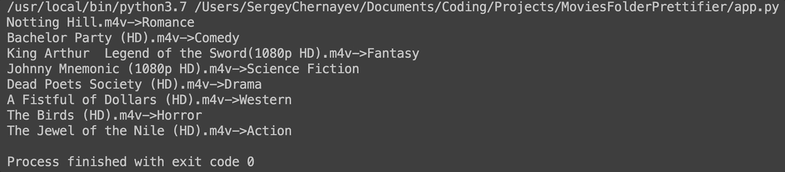

# Movies Folder Prettifier

[](https://www.python.org/downloads/release/python-360/)


[](https://opensource.org/licenses/MIT)

:star: Star me on GitHub — just for fun and motivation :grinning:

Do you have a LOAD of movies on your hard drive ? I have :laughing: 

I am huge fan of movies from 90s, 80s, 70s, 60, ... up to the old school black and white ones. Unfortunately, they were scattered around `Movie` folder on my Seagate external hard drive.  

So one day I have decided to beautify the folder by classifying and moving all the movies into the right **Genre** folders. Being a lazy person I have decide to use **Python** to do all the hard work :blush:

============

==================================================================


## Table of contents

-   [Idea](#idea)
-   [dummyMoviesGenerator.py](#dummyMoviesGenerator.py) 
-   [API](#api)
-   [api_request.py](#api_request.py)
-   [app.py](#app.py)
-   [Credits](#credits)

## Idea

The idea behind this little project was to find API that is going to determine based on the title of the movie which genre it belongs to. If the folder with the genre name exists,the script will put it into it, otherwise it will create the needed folder and move the video file. 

This was a little outline of what I wanted to do, so let's now look at the implementation.

## dummyMoviesGenerator.py

This script creates dummy MKV movie files for testing purposes.

I create a `FOLDERPATH` variable with a path to the test folder. In order to make the most accurate tests, I have decided to make a dictionary `movies_db` where keys will be four genres (*westerns*, *horrors*, *dramas*, *fantasies*) and corresponding values will be lists with the most iconic titles. 

```python
import os
from random import choices

FOLDERPATH = '.../MoviesFolderPrettifier_movies_list'

movies_db = {
    'westerns': ['Once Upon a Time in the West', 'Unforgiven',  'The Wild Bunch',
            'No Country for Old Men',  'They Died with Their Boots On',  'Will Penny',
            'The Treasure of the Sierra Madre', 'Butch Cassidy and the Sundance Kid',  'The Ox-Bow Incident',
            'The Man Who Shot Liberty Valance', 'Monte Walsh'],

    'horrors': ['HELLRAISER', 'Phantasm', 'Scream',
          '28 Days Later...', 'The Conjuring', "WES CRAVEN'S NEW NIGHTMARE ",
          'Pitch Black', 'The Descent', 'Saw',
          'Split', '1408', 'Jeepers Creepers'],

    'dramas': ['Titanic', 'American Beauty', 'Gran Torino',
         "One Flew Over the Cuckoo's Nest", 'Green Book', 'Gone with the Wind',
         '12 Angry Men', 'Wonder', 'The Book of Henry',
         'The Pursuit of Happyness', 'The Last Samurai', 'The Bucket List'],

    'fantasies': ['The Lord of the Rings: The Fellowship of the Ring', 'Avatar', 'Hugo',
             'Groundhog Day', 'Star Wars: Episode IV - A New Hope', 'Harry Potter and the Deathly Hallows: Part 1',
             'Midnight in Paris', 'The Mummy', 'Constantine',
             'Doctor Strange', 'Dead Man', 'Wonder Woman', 'Thor: Ragnarok'],
}
```

In the `generate_dummy_movies()` function I populate `movies_local_list` with 4 random titles of every genre from `movies_db` using `choice()` function.

After that for every item in the `movies_local_list` I append '.mkv' extension and then create this file by opening it and then closing. 

```python
def generate_dummy_movies():
    movies_local_list = []
    for key in movies_db:
        movies_local_list.extend(choices(movies_db[key], k=4))

    print(movies_local_list)
    for item in movies_local_list:
        filename = item + '.mkv'
        filepath = os.path.join(FOLDERPATH, filename)
        f = open(filepath, 'a').close()


generate_dummy_movies()

```
<a href='https://www.themoviedb.org'>
    
</a>

## API

My choice for a movie database obviously fell on [IMDb](https://www.imdb.com), but they had no native api :disappointed: So I found [The Movie Database (TMDb)](https://www.themoviedb.org), which has an [API](https://developers.themoviedb.org/3/getting-started/introduction), that accommodates all my needs. I can send a GET seach request based on the name of the movie file and get all the information about the flick including the genre information.

## api_request.py

So I have written a function that acceptes a title and adds it to the `payload` object as a query. I my case `payload` which I send via GET request to the API. As a response I get a json object, where from results I get the first movie (should be our title) and extract its `genre_ids`.

```python
import requests

url = 'https://api.themoviedb.org/3/search/movie'

payload = {
    'api_key': '...',
    'language': 'en-US',
    'page': 1,
    'include_adult': 'true',
}

def movie_genre_finder(title):

    payload['query'] = title
    r = requests.get(url, params=payload)
    json_res = r.json()
 
    if json_res['results']:
        genre_id = json_res['results'][0]['genre_ids']
        if 878 in genre_id:
            return "Science Fiction"
        elif 14 in genre_id:
            return "Fantasy"
        else:
            for item in genres:
                if item['id'] == genre_id[0]:
                    return item['name']
    else:
        return '!MOV'
```

Unfortunately, the API does not return just one genre, which is kind of obvious. One movie can be both a Thriller and an Action flick (take [John Wick](https://www.imdb.com/title/tt2911666/) for example). What it does return is `genre_ids` - a list of numbers, where every number corresponds to a particular genre, but I need strings for the folder names.

So I have found that API gives a list of all `genre_id` value pairs also using GET request. In order not to make a lot of request I have decided to take the raw list with genres and hardcode it into the [api_request.py](./api_request.py).

```python
genres = [
    {
      "id": 28,
      "name": "Action"
    },
    {
      "id": 12,
      "name": "Adventure"
    },
    {
      "id": 16,
      "name": "Animation"
    },
    {
      "id": 35,
      "name": "Comedy"
    },
    {
      "id": 80,
      "name": "Crime"
    },
    {
      "id": 99,
      "name": "Documentary"
    },
    {
      "id": 18,
      "name": "Drama"
    },
    {
      "id": 10751,
      "name": "Family"
    },
    {
      "id": 14,
      "name": "Fantasy"
    },
    {
      "id": 36,
      "name": "History"
    },
    {
      "id": 27,
      "name": "Horror"
    },
    {
      "id": 10402,
      "name": "Music"
    },
    {
      "id": 9648,
      "name": "Mystery"
    },
    {
      "id": 10749,
      "name": "Romance"
    },
    {
      "id": 878,
      "name": "Science Fiction"
    },
    {
      "id": 10770,
      "name": "TV Movie"
    },
    {
      "id": 53,
      "name": "Thriller"
    },
    {
      "id": 10752,
      "name": "War"
    },
    {
      "id": 37,
      "name": "Western"
    }
  ]
```

Returning back to `movie_genre_finder(title)`, I have made an if statement that first checks if the `genre_id` has some particular ids (for SciFi and Fantasy) that I want explicitly to stand out. It was done because a lot of movies have there first genre id in the list equal to 28 (Action), and more specific ones come after it. 

In the end the function returns a name from `genres` list or `!MOV`, which stands for **NOT A MOVIE**.

## app.py

Before diving into the main [app.py](./app.py) file, I'll crarify, that in my movie collection I have mostly `.m4v` and `.mkv` files with the names like this: `Christopher Robin (1080p HD)` or `Aquaman.WEB-DL.1080p`. So in order to make a clear nice query to the API, I need to do some cleaning up with the file name.

Looking at [app.py](./app.py), I have defined a `FOLDERPATH` variable for a path to the folder with movies. Then for every `file` in the folder I first print file for error checking and testing, after that I use `try` `except` scenario for the issue I have described before about two types of names my movies have.

In the `try` case I check if the file is a `.DS_Store` (*could not get read of it*) or a folder. Then I get the part of the file before the opening bracket as in this example `Christopher Robin (1080p HD)` and get the `genre` by using `movie_genre_finder()` function defined earlier. 

`genre` is checked for **NOT A MOVIE** case if the folder of such a name already does not exists. If not it is created. Then the file is inserted into the folder. 

The `except IndexError` is the same in all the statements, but it catches the case when the movie file has a name like `Aquaman.WEB-DL.1080p`. 

```python
import os
import shutil
from api_requests import movie_genre_finder

FOLDERPATH = '...'

def main():
    for file in os.listdir(FOLDERPATH):
        print(file)
        try:
            if not file == '.DS_Store' and not os.path.isdir(FOLDERPATH + file):
                genre = movie_genre_finder(file.split('(')[-2])
                if (genre != '!MOV') and (not os.path.exists(os.path.join(FOLDERPATH, genre))):
                    os.makedirs(os.path.join(FOLDERPATH, genre))

                if os.path.exists(os.path.join(FOLDERPATH, genre)):
                    file_path = FOLDERPATH + file
                    print(file + '->' + genre)
                    shutil.move(file_path, os.path.join(FOLDERPATH, genre))
        except IndexError:
            if not file == '.DS_Store' and not os.path.isdir(FOLDERPATH + file):
                genre = movie_genre_finder(file.split('.')[0])
                if (genre != '!MOV') and (not os.path.exists(os.path.join(FOLDERPATH, genre))):
                    os.makedirs(os.path.join(FOLDERPATH, genre))

                if os.path.exists(os.path.join(FOLDERPATH, genre)):
                    file_path = FOLDERPATH + file
                    print(file + '->' + genre)
                    shutil.move(file_path, os.path.join(FOLDERPATH, genre))


if __name__ == "__main__":
    main()
```

## Credits 
<div>Icon of the brush for my logo was made by <a href="https://www.flaticon.com/authors/freepik" title="Freepik">Freepik</a> from <a href="https://www.flaticon.com/"             title="Flaticon">www.flaticon.com</a></div>

<div>Icon of a movie folder was made by <a href="https://www.flaticon.com/authors/srip" title="srip">srip</a> from <a href="https://www.flaticon.com/"             title="Flaticon">www.flaticon.com</a></div>